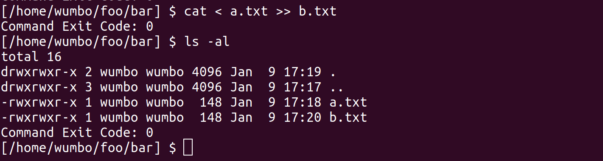
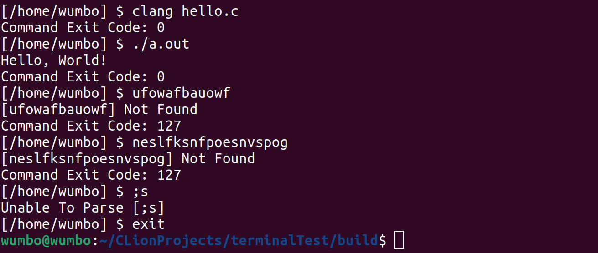

# Scuffed Shell

## Purpose
scuffed_shell is a simple Unix shell that supports:
- running simple commands
- redirecting stdin, stdout, and stderr

Documentation for the shell can be found [here](https://drive.google.com/drive/folders/12Tg4KIyXlM2VgQ2s6malkj_UPyYp9oTh?usp=sharing).

## Installing

### Prerequisites
This program assumes the DC libraries are installed. If not, installation instructions can be found [here](https://docs.google.com/document/d/1LQ5shikJ4qqEFVpaaibicFSfpBmCC0gME5I8_g8mW-A/edit).

Note: If you encounter any error claiming ndbm.h not found try the following commands
``` terminal
sudo apt-get install apt-file
sudo apt-file update
sudo apt-file search ndbm.h
sudo apt install libgdbm-compat-dev
sudo apt install libgdbm-dev
```

### Building
cmake -S . -B build
cmake --build build

The compiler can be specified by passing one of the following to cmake:

- -DCMAKE_C_COMPILER="gcc" -DCMAKE_CXX_COMPILER="g++"
- -DCMAKE_C_COMPILER="clang" -DCMAKE_CXX_COMPILER="clang++"

### Running
./ScuffedShell

### Environment Variables

The following environment variables alter the behaviour of scuffed_shell:

| Variable | Purpose                                             |
|----------|-----------------------------------------------------|
| PATH     | The directories to search for commands              |
| PS1      | The prompt to display, if not set, defaults to ‘$.’ |

## Features
- scuffed_shell only supports executing simple commands with optional I/O redirection.
- The PATH environment variable is searched for each command.
- After a command completes, the exit status is displayed.

### Built-in Commands
scuffed_shell supports the following built-in commands:

| Command | Purpose                  |
|---------|--------------------------|
| cd      | Change working directory |
| exit    | Exit the shell           |

### Limitations
- A program name has a space it cannot be run
- Tab completion is not implemented
- Command history is not implemented

The following command types are not supported:
- Pipelines (|)
- Lists (;, &, &,&, ||)
- Compound (if, case, until, while, for, ())
- Functions

## Examples
### Startup

### Cat command 

### Multiple commands

### Exit

